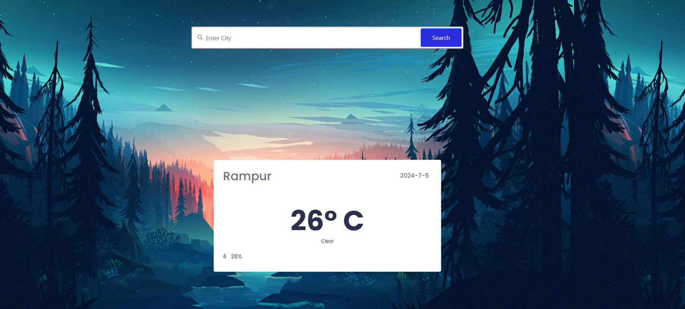

# WEATHER-APP-API [Live_Demo](https://99dino.github.io/weather-app-api/)

This project was created using open-weather API.
It is a single website build with HTML, CSS, BOOTSTRAP AND JAVASCRIPT.

Enter you city into the search and press the search icon or hit Enter.
You will see current city tempreture, sky-description, humidity and current date.

If you make a mistake with your city name, you will be alerted.
( Will connect data list to choose from matching city for convenience )

